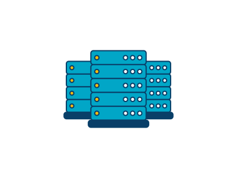

# Introduction to Cloud Computing
The concept of cloud computing has been around since the 1960s and the idea originated from the requirement of scalability in computer's resources like network, menory, disk etc. Like the following graph explaind on how PCs scalled to data centers.

#### PC
