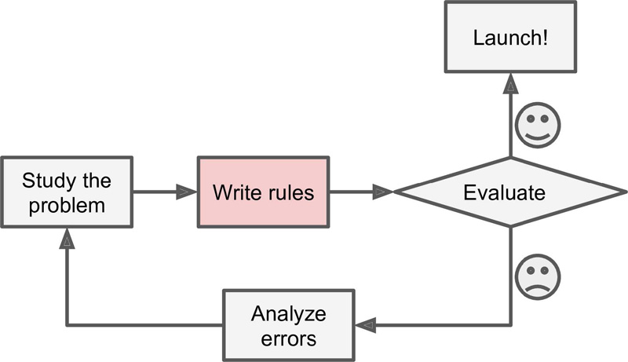
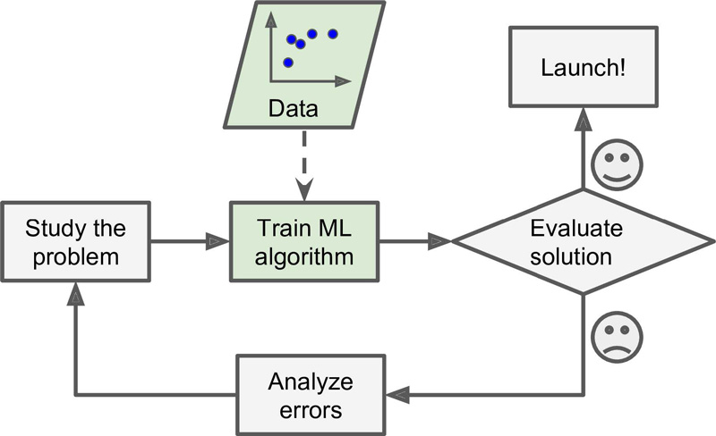
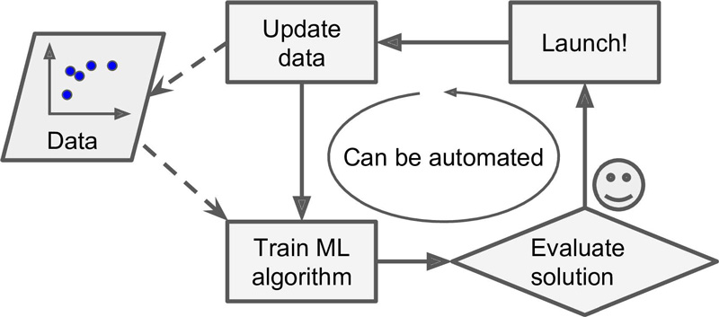
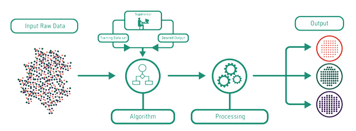
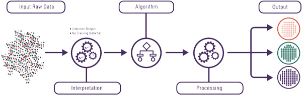
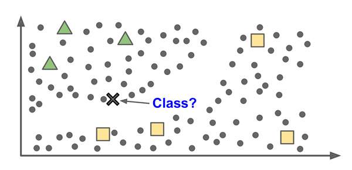
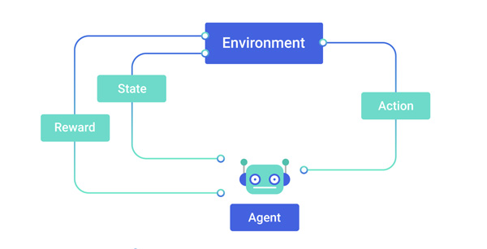
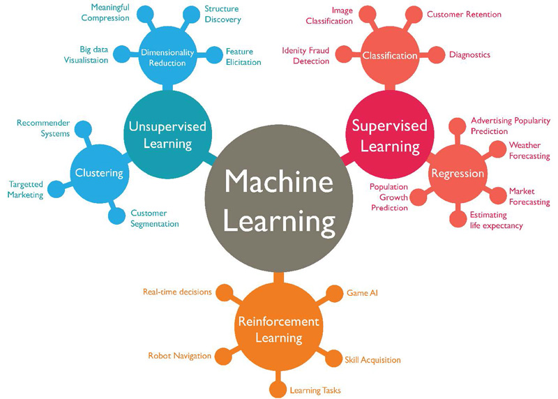
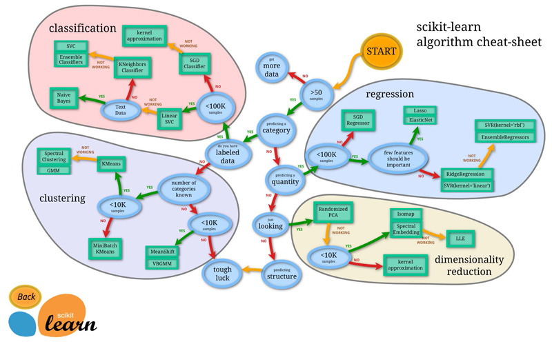

# What is machine learning?
Machine Learning is the science of programming computers so they can learn from data.

> Machine Learning is the field of study that gives computers the ability to `learn` without being explicitly programmed. - Arthur Samuel, 1959

or 

> A computer program is said to learn from `experience E` with respect to some `task T` and some `performance` `measure P`, if its `performance on T`, as `measured by P`, improves with `experience E`. - Tom Mitchell, 1997

# Why use Machine Learning?
The traditional problem solving approach using set of rules to solve a problem, it's good for problems that have limited rules. But fot not trivial problmes, the program will likely become a long list of complex rules—pretty hard to maintain.



In contrast, Machine Learning techniques automatically learns which patterns, rules applied in sample or data-set. So the program is much shorter, easier to maintain, and most likely more accurate.



Moreover, if new patterns/rules arrised in the new data set, the Machine Learning techniques automatically update the the system.


Another area where Machine Learning shines is for problems that either are too complex for traditional approaches or have no known algorithm. For example, speech recognition.
# Types of Machine Learning Systems

There are so many different types of Machine Learning systems. Useful to classify them in broad categories based on:
* Whether or not they are trained with human supervision (`supervised`, `unsupervised`, `semisupervised`, and `Reinforcement Learning`)
* Whether or not they can learn incrementally on the fly (`online learning` versus `batch learning`)
* Whether they work by simply comparing new data points to known data points, or instead detect patterns in the training data and build a predictive model, much like scientists do (`instance-based` learning versus `model-based learning`)

## Supervised learning
Learn from data to decide how to assign labels to an object. Where the data is labelled. Email spam filter is a good example
of this: as training data labeled spam and not-spam



Here are some of the most important supervised learning algorithms：
* k-Nearest Neighbors
* Linear Regression
* Logistic Regression
* Support Vector Machines (SVMs)
* Decision Trees and Random Forests
* Neural networks2
## Unsupervised learning
In unsupervised learning, as you might guess, the training data is unlabeled



Here are some of the most important unsupervised learning algorithms：
* Clustering
    * K-Means
    * DBSCAN
    * Hierarchical Cluster Analysis (HCA)
* Anomaly detection and novelty detection
    * One-class SVM
    * Isolation Forest

## Semisupervised learning
Some algorithms can deal with partially labeled training data, usually a lot of unlabeled data and a little bit of labeled data. This is called semisupervised learning

Most semisupervised learning algorithms are combinations of unsupervised and supervised algorithms. For example, deep belief networks (DBNs).


## Reinforcement Learning
Supervised/unsupervised learning is where a learning agent is provided with data on which to base its learning. However learning is sometimes needed in less generous environments
* No `examples/data` provided
* No `model` of the environment
* No `utility function` at all! 
  
The agent relies on feedback about its performance on order to assess its functionality, the agent learn by itself what is the best strategy, called a policy, to get the most reward over time.




## S




## Batch Learning
In batch learning, the system is incapable of learning incrementally: it must be trained using all the available data. This will generally take a lot of time and computing resources, so it is typically done offline.

## Online Learning
In online learning, you train the system incrementally by feeding it data instances sequentially, either individually or by small groups called mini-batches. Each learning step is fast and cheap, so the system can learn about new data on the fly, as it arrives.

## Instance-Based Versus Model-Based Learning
Model based learning algorithms use the training data to create a model that has parameters learned from the training data. For example linear regression, SVM. After the model is built, the training data can be discarded.

Instance-based learning use the entrie dataset as the model. Such as KNN.

# Multilabel vs Multioutput-Multiclass Classification
| Tables                                | Number of class labels | Cardinality of each label |
| ------------------------------------- |:----------------------:| -------------------------:|
| Multiclass classification             | 1                      | > 2                       |
| Multilabel classification             | > 1                    | 2                         |
| Multioutput-multiclass classification | > 1                    | > 2                       |

# Main Challenges of machine learning
* Insufficient Quantity of Training Data
* Non-representative Training Data
* Poor-Quality Data(full of errors, outliers, and noise)
* Irrelevant Features
  * A critical part of the success of a Machine Learning project is coming up with a good. This process, called feature engineering involves:   
    * `Feature selection`: selecting the most useful features to train on among existing features.
    * `Feature extraction`: combining existing features to produce a more useful one
set of features to train on.
* Overfitting the Training Data
* Underfitting the Training Data
* Stepping Back

```python
import json
import math
```
